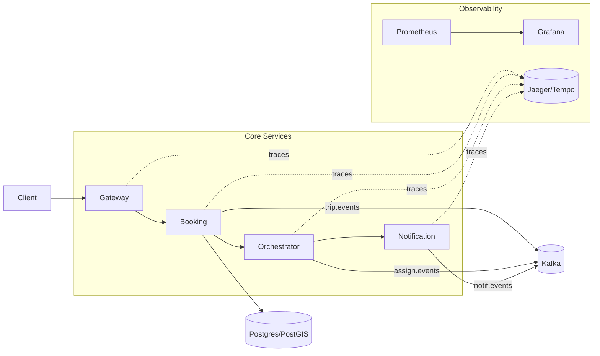
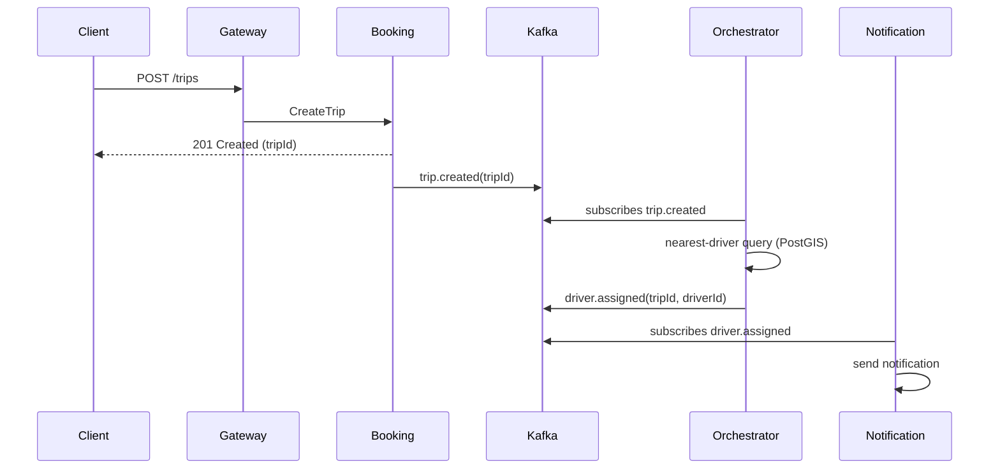
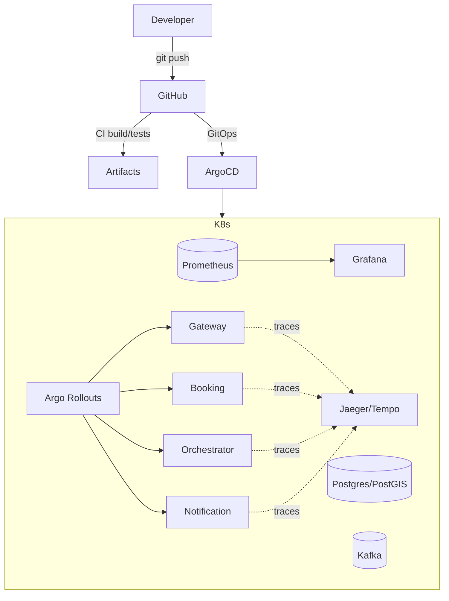

# Uber-like Backend — Technical Architecture (For Entry-Level Engineers)

This document explains the complete technical architecture of our Uber-like backend platform. It covers the what, why, and how of each major component so you can confidently build, run, and extend the system.

---

## 1. Product and System Goals
- Functional goals
  - Riders can create trips, see ETA and driver status.
  - Drivers receive assignments and status updates.
  - Notifications (push/email) sent at key lifecycle events.
- Non-functional goals
  - Reliability and fault tolerance under failures.
  - Horizontal scalability to handle spikes.
  - Observability and fast troubleshooting.
  - Security by default, least-privilege access, auditable changes.

## 2. High-Level Architecture

- Gateway: Edge/API gateway, authZ, rate limiting, routing.
- Booking: Trip creation, persistence, emitting domain events.
- Orchestrator: Consumes events, reserves drivers (nearest-driver logic).
- Notification: Consumes events, sends user/driver notifications.
- Kafka: Asynchronous decoupling between services.
- Postgres/PostGIS: Primary data store for trips and geospatial queries.
- Observability: Prometheus (metrics), Grafana (dashboards), Jaeger/Tempo (traces).

## 3. Services and Responsibilities
- Gateway Service
  - Validates JWT via JWKS, enforces route-level scopes.
  - Rate limits by client IP (Redis-backed key resolver).
  - Routes requests to internal services.
- Booking Service
  - Accepts trip creation requests, validates input, persists to DB.
  - Emits `trip.created` events to Kafka.
  - Optional analytics export to S3 (feature-flagged).
- Orchestrator Service
  - Consumes `trip.created`, queries PostGIS for nearest available driver.
  - Emits `driver.assigned` or `driver.reservation_failed` events.
- Notification Service
  - Consumes assignment and trip lifecycle events.
  - Sends notifications via provider integrations; tracks delivery status.

## 4. Data and Domain Model (simplified)
- Trip
  - id, riderId, origin(lat,lng), destination(lat,lng), status, createdAt
- Driver
  - id, location(lat,lng), availability, rating
- Assignment
  - tripId, driverId, assignedAt, status

Indexes and storage
- Postgres: normalized entities, foreign keys as appropriate.
- PostGIS: GiST index on geography columns; distance queries via ST_DWithin/ST_Distance.

## 5. Kafka Topics and Messaging
- Topics
  - `trip.created` (key: `tripId`) — emitted by Booking.
  - `driver.assigned` (key: `tripId`) — emitted by Orchestrator.
  - `notification.send` (key: `tripId` or `userId`) — emitted by Notification.
- Consumer groups
  - Each service uses one group per logical consumer; horizontal scaling balances partitions.
- Reliability patterns
  - Idempotency: dedupe store keyed by eventId or (tripId, version).
  - Retries & DLQ: `*.retry` and `*.dlq` topics with exponential backoff.
  - Ordering: partition key = `tripId` to preserve in-key order.

## 6. Synchronous and Asynchronous Flows
- Sync (HTTP) flow
  - Client → Gateway → Booking (returns 202/201 for trip creation).
- Async (event-driven) flow
  - Booking → Kafka(`trip.created`) → Orchestrator → Kafka(`driver.assigned`) → Notification.

Sequence view

## 7. Environment, Deployment, and Branching
- Branching strategy
  - week-0 … week-12 branches reflect incremental features per week.
- Packaging & deployment
  - Helm charts per service (Deployment, Service, Ingress, HPA, secrets, SA/IRSA).
  - Argo CD GitOps manages reconciliation from Git to clusters.
  - Argo Rollouts provides canary updates with Prometheus analysis.
- Environments
  - dev → staging → prod promotion via Git revisions/values.

## 8. Networking and Service Mesh
- Ingress: NGINX or Istio IngressGateway to expose Gateway service.
- Istio mesh
  - PeerAuthentication STRICT mTLS for zero-trust.
  - DestinationRule: `ISTIO_MUTUAL`, timeouts, retries, outlier detection.
  - VirtualService: routing rules per service.

## 9. Security
- AuthN/Z at Gateway
  - OAuth2 Resource Server validates JWT via JWKS (JWK Set URI).
  - Route-level scopes via Spring Security expressions.
- Rate limiting
  - Redis-based rate limit with remote address key resolver.
- Secrets and cloud creds
  - IRSA for AWS access in-cluster; or Kubernetes Secrets (non-prod).
- mTLS in-mesh via Istio.

## 10. Observability
- Metrics
  - Micrometer exposes /actuator/prometheus. Prometheus scrapes; Grafana dashboards for golden signals.
- Tracing
  - OpenTelemetry auto-instrumentation; W3C `traceparent` propagation via Gateway and services; traces in Jaeger/Tempo.
- Logging
  - Structured logs (JSON) with `traceId`/`spanId` for correlation.
- Alerts
  - Prometheus rules for error rate spikes, latency SLOs, Kafka lag, HPA/KEDA saturation.

## 11. Reliability and Chaos Engineering
- Patterns
  - Timeouts, retries with backoff/jitter, circuit breaking/outlier detection.
  - Bulkheads and resource limits (requests/limits) per pod.
- Chaos
  - Pod kill, network delay experiments via Chaos Mesh/Litmus.
  - Steady-state hypotheses and abort conditions captured in runbooks.

## 12. Performance and Autoscaling
- HPA on CPU/memory for web workloads.
- KEDA (optional) on event-driven signals like Kafka lag.
- Right-sizing resources to meet p95 targets with minimal cost.
- k6 scripts with thresholds integrated into CI/nightly.

## 13. Multi-Region and Global Routing (Advanced)
- Two regions with MSK/Kafka each; MirrorMaker 2 for critical topics.
- Route53/CloudFront latency-based routing and health checks.
- Data strategy: read-local, write-primary; conflict avoidance and idempotency.

## 14. CI/CD
- Build & test via GitHub Actions.
- GitOps: Argo CD syncs from Git to clusters.
- Rollouts: Canary with metrics-based analysis and auto-rollback.
- Nightly load test: `k6-nightly.yml` runs synthetic journeys and stores artifacts.

## 15. Local Development and Running
- Prerequisites
  - JDK 17+, Maven, Docker, kubectl, Helm
  - Optional: kind/minikube, Prometheus, Grafana, Jaeger
- Quick start (local-only)
  - Build: `mvn -q -DskipTests package`
  - Start services (IDE or `java -jar`).
  - Start Postgres and Kafka (Docker Compose).
- K8s with Helm
  - `helm install` each chart with env-specific values.
  - Configure Ingress/Gateway hostnames and DNS.

## 16. Runbooks (Where to Look)
- Verification: monitoring/RUNBOOK-VERIFICATION.md
- Weekly guide: docs/WEEKLY-RUNBOOK.md
- Dashboards: monitoring/grafana/*.json
- Alerts: k8s/prometheus/alerts/*.yaml

## 17. Key Code/Config Touchpoints
- Gateway
  - `gateway-service/src/main/java/.../security/SecurityConfig.java` (JWT scopes)
  - `gateway-service/src/main/java/.../rate/RateLimitConfig.java` (IP resolver)
  - `gateway-service/src/main/resources/application.yml` (filters, JWKS, Redis)
- Booking
  - `.../analytics/S3Exporter.java` (feature-flagged export)
  - Kafka producer config and trip event producer class
- Helm & K8s
  - `helm/*/templates/*` for Deployments, Services, Rollouts, ServiceMonitors
  - `k8s/istio/*` for PeerAuthentication, DestinationRules, VirtualServices
  - `k8s/prometheus/*` for standalone Prometheus and alert rules
  - `k8s/chaos-mesh/*` for chaos experiments
- CI/CD
  - `.github/workflows/k6-nightly.yml` for nightly load tests

## 18. Common Pitfalls and Tips
- Missing scopes cause 403 on routes — verify JWT claims and Security config.
- Inconsistent mTLS/DR config leads to 503s — align Istio policies across namespaces.
- Partition key mistakes break ordering — use `tripId` consistently.
- Idempotency absent → duplicate side-effects — ensure dedupe keys.
- Over-aggressive retries → retry storms — set sane caps and backoff.

## 19. Glossary
- mTLS: Mutual TLS inside the service mesh.
- DLQ: Dead-Letter Queue for failed messages.
- IRSA: IAM Roles for Service Accounts (AWS).
- HPA/KEDA: Horizontal Pod Autoscaler / Kubernetes Event-Driven Autoscaling.
- GiST: Generalized Search Tree index for PostGIS.

---

## 20. End-to-End Deployment Diagram

This document should serve as your single source of truth for understanding how the system is structured, how components interact, and where to make changes safely. Refer back to the weekly docs for incremental context and hands-on steps.
