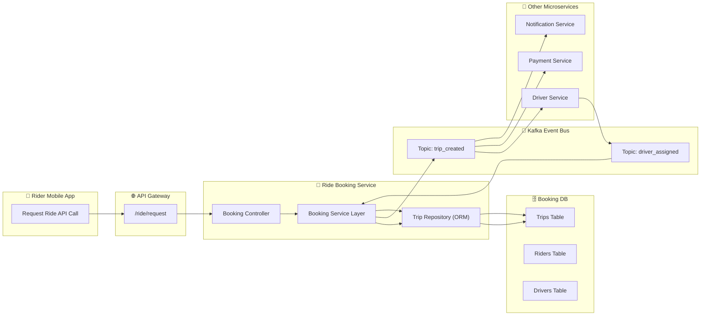
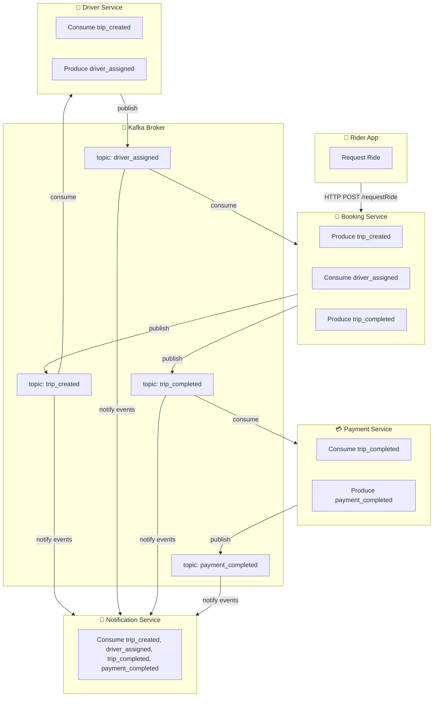

# Week 2 — Domain Modeling, Microservices Architecture & Database Design

## Weekly Goal
By the end of Week 2, you’ll be able to:
- Design the Ride Booking core service (the heart of Uber).
- Model entities and relationships in a microservices-based architecture.
- Understand how services talk to each other via REST + Kafka.
- Implement database schemas, data flow, and service boundaries.
- Think like a backend system designer, not just a coder.

---

## Architecture Diagram (Ride Booking Module)


---

## Database ER Diagram — Ride Booking Core
```mermaid
erDiagram
    RIDER {
        int rider_id PK
        string name
        string phone_number
        float rating
    }

    DRIVER {
        int driver_id PK
        string name
        string vehicle_no
        string status  // AVAILABLE, BUSY, OFFLINE
        float rating
        float current_lat
        float current_long
    }

    TRIP {
        int trip_id PK
        int rider_id FK
        int driver_id FK
        string status  // REQUESTED, ASSIGNED, IN_PROGRESS, COMPLETED, CANCELLED
        string pickup_location
        string dropoff_location
        float fare_estimate
        timestamp created_at
        timestamp updated_at
    }

    PAYMENT {
        int payment_id PK
        int trip_id FK
        float amount
        string status  // INITIATED, SUCCESS, FAILED
        string method  // CARD, UPI, WALLET
        timestamp created_at
    }

    RIDER ||--o{ TRIP : "books"
    DRIVER ||--o{ TRIP : "assigned_to"
    TRIP ||--o{ PAYMENT : "generates"
```

### Why this ER works
- Bounded contexts map to microservices: Booking (TRIP), Driver (DRIVER), Payment (PAYMENT).
- Scales independently; can shard by `trip_id`.
- Trip lifecycle is event-driven (status changes from events).

### Suggested DDL (monolith-phase evolution)
```sql
ALTER TABLE riders
  ADD COLUMN IF NOT EXISTS rating REAL DEFAULT 5.0,
  ADD COLUMN IF NOT EXISTS phone_number VARCHAR(30);

ALTER TABLE drivers
  ADD COLUMN IF NOT EXISTS vehicle_no VARCHAR(20),
  ADD COLUMN IF NOT EXISTS rating REAL DEFAULT 5.0,
  ADD COLUMN IF NOT EXISTS current_lat REAL,
  ADD COLUMN IF NOT EXISTS current_long REAL,
  ALTER COLUMN status SET DEFAULT 'AVAILABLE';

CREATE TABLE IF NOT EXISTS trips (
  trip_id BIGSERIAL PRIMARY KEY,
  rider_id BIGINT NOT NULL REFERENCES riders(id),
  driver_id BIGINT REFERENCES drivers(id),
  status VARCHAR(20) NOT NULL,
  pickup_location VARCHAR(255) NOT NULL,
  dropoff_location VARCHAR(255) NOT NULL,
  fare_estimate REAL,
  created_at TIMESTAMP NOT NULL,
  updated_at TIMESTAMP
);

CREATE TABLE IF NOT EXISTS payments (
  payment_id BIGSERIAL PRIMARY KEY,
  trip_id BIGINT NOT NULL REFERENCES trips(trip_id),
  amount REAL NOT NULL,
  status VARCHAR(20) NOT NULL,
  method VARCHAR(20) NOT NULL,
  created_at TIMESTAMP NOT NULL
);
```

---

## Kafka Event Flow — Event-Driven Ride Lifecycle


### Event Catalog
- `trip_created`: Producer=Booking; Consumers=Driver, Notification. Starts driver assignment.
- `driver_assigned`: Producer=Driver; Consumers=Booking, Notification. Booking updates trip.
- `trip_completed`: Producer=Booking; Consumers=Payment, Notification. Kicks off billing.
- `payment_completed`: Producer=Payment; Consumers=Notification. Receipt + finalization.

### Example Event Payloads
```json
{ "tripId": 12345, "riderId": 1, "pickupLocation": "Airport", "dropoffLocation": "Downtown", "requestedAt": "2025-11-04T09:30:00Z" }
```
```json
{ "tripId": 12345, "driverId": 888, "vehicleNo": "MH01AB1234", "assignedAt": "2025-11-04T09:31:10Z" }
```
```json
{ "tripId": 12345, "distanceKm": 14.5, "durationMin": 35, "completedAt": "2025-11-04T10:05:12Z" }
```
```json
{ "tripId": 12345, "amount": 325.50, "method": "UPI", "status": "SUCCESS", "paidAt": "2025-11-04T10:06:00Z" }
```

---

## Deep Dive: What/Why/How
- **Event-Driven Design**: decouples services; resilient and scalable. Kafka persists events until consumed.
- **Service Boundaries**: Booking manages trips; Driver manages availability; Payment manages billing.
- **Data Consistency**: eventual consistency across services via events.
- **Transaction Flow**: Booking → Kafka → Driver → Kafka → Booking → Kafka → Payment.

## Expected Outcome
- You can explain the architecture, ER design, and event choreography.
- You can outline a Spring Boot Booking service that persists a trip and publishes `trip_created`.

## Next (Week 3 Preview)
- Add Kafka (Zookeeper + Broker) to Docker Compose.
- Booking service publishes `trip_created` on POST /api/trips.
- Simulated consumer for `driver_assigned`.
- Tests and Postman collection.
