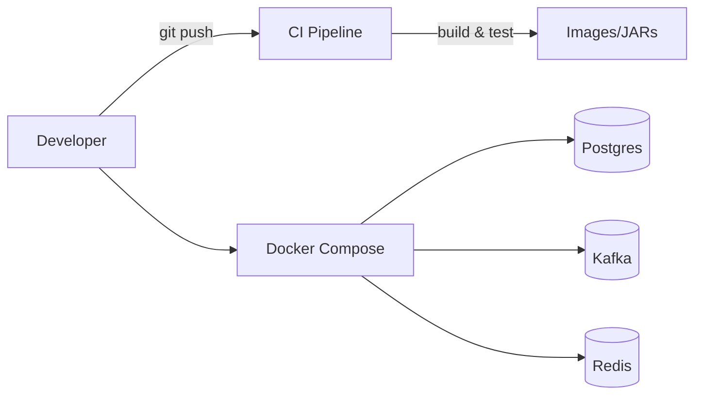

# Week 0 — Project Scaffold, Dev Workflow, and Baseline Observability

## What
- Scaffold a multi-service Spring Boot backend with shared tooling.
- Establish local dev workflow (Docker Compose for infra, basic CI build).
- Provide baseline health checks and metrics.

## Why
- Consistent structure and tooling avoids early rework.
- Health/metrics from day 0 make later SLOs and alerts straightforward.
- Clear dev loop accelerates iteration and collaboration.

## How (behind the scenes)
- Spring Boot 3.3 scaffold, Java 17, Maven parent and shared deps.
- Services expose `/actuator/health`, `/actuator/prometheus`.
- Docker Compose for PostgreSQL, Kafka, Redis (used in later weeks).
- CI: build and test workflow, container image build (where configured).

## Architecture (Mermaid)

## Code flow (high level)
- Controllers → Services → Repos (JPA) with DTOs and validation.
- Actuator auto-configures health and metrics endpoints.

## Learner outcomes
- Understand project layout (modules, configs, Docker Compose).
- Run services locally, hit health endpoints, view Prom metrics.
- Make a trivial endpoint and observe it in logs/metrics.

## Scenario Q&A (what/why/how)
- Q: What if health endpoint is returning down?
  - Why: missing DB/Kafka/Redis or misconfig.
  - How: check Docker Compose, service logs, application.yml.
- Q: Why include metrics from day 0?
  - What: standardized Prometheus metrics via Micrometer.
  - How: later weeks reuse metrics for HPA/KEDA/alerts without code churn.

## Quickstart
- Pre-req: Java 17, Docker, Maven.
- Run infra locally: `docker compose up -d`
- Build: `mvn -q -DskipTests package`
- Run a service: `java -jar service/target/*.jar`
- Verify: `curl :8080/actuator/health`, `curl :8080/actuator/prometheus`
