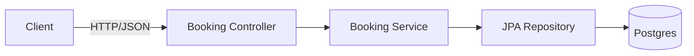

# Week 1 — Booking Vertical Slice (Domain, API, Persistence)

## What
- Implement the Booking vertical slice: REST API, domain model, persistence, validations.
- CRUD for rides/trips with initial happy-path booking flow.

## Why
- Establish a concrete business capability early (booking) to anchor later weeks (Kafka, orchestration, notifications, payments).
- Create a reference service for patterns (DTOs, mapping, error handling, tests).

## How (behind the scenes)
- Layers: Controller → Service → Repository (Spring Data JPA) → Postgres.
- DTO validation (javax validation), exception handlers for clean 4xx/5xx.
- Id generation, created/updated timestamps, simple state machine for Trip (CREATED → ASSIGNED → COMPLETED/CANCELLED).

## Architecture (Mermaid)


## Key classes (UML-style)
```mermaid
classDiagram
  class Trip {
    +UUID id
    +UUID riderId
    +GeoPoint pickup
    +GeoPoint dropoff
    +TripStatus status
    +Instant createdAt
    +Instant updatedAt
  }
  class BookingController {
    +POST /api/rides
    +GET /api/rides/{id}
  }
  class BookingService {
    +createTrip(cmd)
    +getTrip(id)
  }
  class TripRepository {
    <<interface>>
    +save(Trip)
    +findById(UUID)
  }
  BookingController --> BookingService
  BookingService --> TripRepository
```

## Data flow
1) Client posts booking request.
2) Controller validates payload; maps to command.
3) Service creates Trip aggregate, persists via repository.
4) Returns 201 with resource id.

## Learner outcomes
- Design a vertical slice with clean boundaries and DTO validation.
- Implement JPA entities and repositories; handle transactions.
- Build controller tests and service unit tests.

## Scenario Q&A (what/why/how)
- Q: What if duplicate booking requests arrive?
  - Why: client retries/timeouts.
  - How: idempotency via requestId header or unique constraint on (riderId, createdAt window).
- Q: Why separate DTO and entity?
  - What: prevents over-posting and persistence leakage.
  - How: explicit mappers; DTO carries only API surface.
- Q: How to handle invalid coordinates?
  - What: bean validation and custom validator.
  - How: @Valid + Constraint for lat/lon ranges; return 400 with field errors.

## Expectations by end of Week 1
- Booking endpoints functional locally and in CI.
- Health and metrics available at actuator endpoints.
- Tests cover happy path and key error cases.
