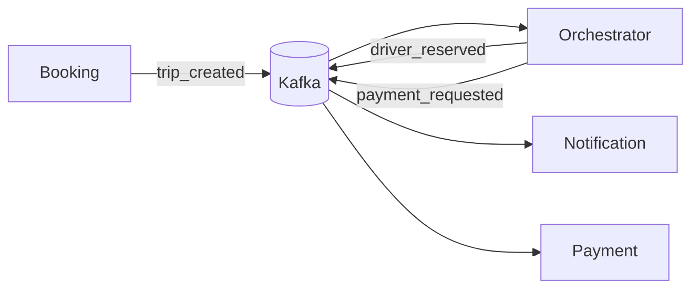

# Week 2 — System Design, ERD, and Event Flows

## What
- Document domain model (ER diagram) and core microservice boundaries.
- Define Kafka event flows for trip lifecycle.

## Why
- Clear domain and event contracts reduce rework and integration bugs.
- Sets up a shared language for subsequent implementation.

## How (behind the scenes)
- ERD for riders, drivers, trips, payments, notifications (normalized with FKs).
- Event definitions (topic names, payload schemas, keys, retention hints).

## Architecture (Mermaid)

## Sample schemas
- trip_created: { eventId, tripId, riderId, pickup, dropoff, ts }
- driver_reserved: { tripId, driverId, eta, ts }
- payment_requested: { tripId, amount, method, ts }

## Learner outcomes
- Map domain entities to tables and design for query patterns.
- Define event contracts (keys, partitions) to ensure ordering where needed.

## Scenario Q&A
- Q: Why partition by tripId?
  - What: guarantees per-trip ordering.
  - How: use tripId as Kafka message key.
- Q: How to evolve schemas safely?
  - What: backward-compatible fields and defaulting.
  - How: add new optional fields; prefer append-only changes.
