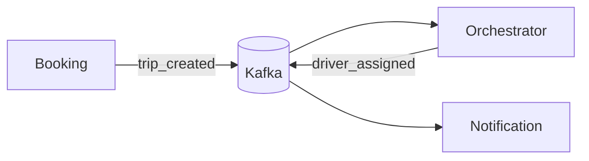

# Week 3 — Kafka Foundations: Events, Producers, Consumers, Idempotency

## What
- Stand up Kafka locally, add producers/consumers for booking events.
- Establish idempotency and error handling patterns.

## Why
- Async decoupling improves resilience and throughput.
- Idempotency assures exactly-once effects at consumers despite retries.

## How (behind the scenes)
- spring-kafka with JsonSerializer/Deserializer and trusted packages.
- Topics: trip_created, driver_assigned, trip_completed, payment_completed.
- Idempotency store (e.g., Redis/DB) keyed by eventId to avoid reprocessing.
- Retry/backoff and DLT pattern for poison messages.

## Event flow (Mermaid)

## Learner outcomes
- Configure spring-kafka reliably (acks, retries, consumer groups).
- Implement idempotent consumer logic and DLT routing.
- Validate ordering with partitioning by tripId.

## Scenario Q&A
- Q: Why are consumers idempotent?
  - What: at-least-once delivery may redeliver messages.
  - How: dedupe on eventId or unique business key.
- Q: How to handle poison messages?
  - What: messages that always fail.
  - How: route to DLT after N attempts; alert and inspect.
