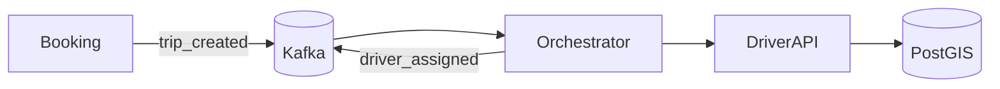

# Week 4 — Orchestrator, Nearest Driver, and Business Metrics

## What
- Introduce Orchestrator service to reserve drivers for trips.
- Integrate PostGIS (nearest-driver query) to select optimal driver.
- Add business counters (e.g., trips_created_total, trips_assigned_total).

## Why
- Separates coordination logic from booking for clearer ownership (saga-friendly).
- Geospatial proximity is core to rider ETAs and driver utilization.
- Business metrics enable product-level visibility and SLOs.

## How (behind the scenes)
- Booking emits `trip_created` → Orchestrator consumes and queries Driver API/PostGIS for nearest available.
- Orchestrator publishes `driver_assigned` (or `driver_reservation_failed`).
- Micrometer counters record trip lifecycle transitions.

## Architecture (Mermaid)

## Learner outcomes
- Implement orchestration over async boundaries.
- Run nearest-neighbor queries with geospatial indexes.
- Expose business KPIs via Micrometer and view in Prometheus/Grafana.

## Scenario Q&A
- Q: What if no drivers found nearby?
  - Why: low supply or tight radius.
  - How: expand search radius progressively, publish reservation_failed, notify user/waitlist.
- Q: Why use PostGIS vs. in-memory filtering?
  - What: spatial indexes and accurate distance ops.
  - How: GiST index on geography types; ST_DWithin/ST_Distance queries.
