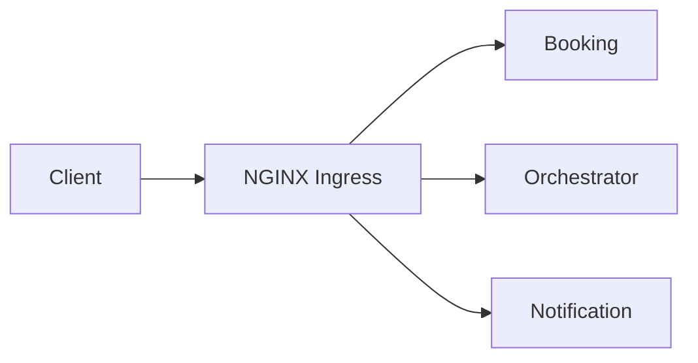

# Week 5 — Kubernetes Packaging (Helm), Ingress, and Autoscaling

## What
- Package services with Helm charts (Deployment, Service, Ingress).
- Add probes, resources, and HorizontalPodAutoscaler (HPA).
- Set up NGINX Ingress routing per service.

## Why
- Declarative, repeatable deployments across environments.
- Probes + resources enable stability and right-sizing.
- Ingress standardizes external access through one entry point.

## How (behind the scenes)
- Helm values for image, env, probes, resources, replicas.
- HPA targets CPU (and can extend to memory/custom metrics later).
- NGINX ingress annotations and host-based routing.

## Architecture (Mermaid)

## Learner outcomes
- Understand Helm templating and values overrides.
- Configure probes and requests/limits appropriately.
- Validate HPA behavior under load.

## Scenario Q&A
- Q: Why probes are failing in staging?
  - What: wrong path/port, app not ready.
  - How: align actuator paths with probes; add initialDelay; check logs.
- Q: HPA not scaling?
  - What: metrics-server missing or thresholds too high.
  - How: install metrics-server; set targetCPUUtilizationPercentage to realistic value.
