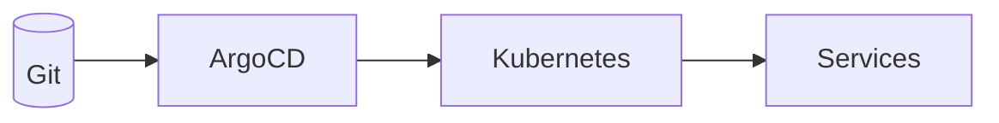

# Week 6 — GitOps with Argo CD and Environment Promotion

## What
- Introduce GitOps with Argo CD Applications per service.
- Manage environment drift via declarative manifests.
- Add basic promotion strategy (dev → staging → prod) through branches.

## Why
- Single source of truth in Git; automatic reconciliation.
- Safe, auditable rollouts with clear history and diffs.

## How (behind the scenes)
- Argo CD Applications point at Helm charts and specific targetRevision (week branches).
- Health checks use Kubernetes status + readiness probes.
- Sync policies (manual/auto) control rollout cadence.

## Architecture (Mermaid)

## Learner outcomes
- Define Argo CD Applications referencing Helm charts.
- Understand sync options and health checks.
- Promote versions by updating targetRevision.

## Scenario Q&A
- Q: Why GitOps vs kubectl apply from CI?
  - What: Pull-based reconcile vs push-based deployments.
  - How: Argo CD monitors Git and reconciles cluster to desired state.
- Q: Handling secrets in GitOps?
  - What: sealed-secrets/external-secrets.
  - How: encrypt or reference cloud secret backends.
