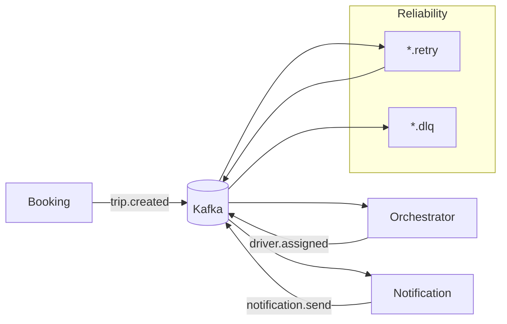

# Week 8 — Kafka Integration: Reliability, Idempotency, and Schema Evolution

## What
- Introduce Kafka topics for trip lifecycle and notifications.
- Implement consumer groups, partitions, and ordering guarantees per key.
- Add retry, dead-letter queues (DLQ), and idempotency.
- Manage payload contracts via Schema Registry (Avro/JSON Schema) and versioning.

## Why
- Decouple services and smooth traffic spikes with durable async messaging.
- Prevent duplicate side-effects under at-least-once delivery.
- Evolve payloads safely without breaking consumers.

## How (behind the scenes)
- Topics: `trip.created`, `driver.assigned`, `notification.send`, with partitions keyed by `tripId` for in-key ordering.
- Consumers use the same groupId per service for horizontal scale and balanced partitions.
- Retries: on processing error, publish to `*.retry` with backoff; after max attempts, route to `*.dlq`.
- Idempotency: dedupe store keyed by `eventId` or `(tripId, version)` to ensure exactly-once effects at the app level.
- Schema evolution: backward-compatible changes (add optional fields); producers bump version; consumers tolerate unknown fields.

## Architecture (Mermaid)

## Learner outcomes
- Choose keys/partitions to balance scale with ordering requirements.
- Implement at-least-once consumers with idempotency and DLQs.
- Apply schema evolution strategies with a registry.

## Scenario Q&A
- Q: Duplicate notifications observed — why?
  - What: consumer reprocessing after crash/offset commit race.
  - How: use idempotency keys and side-effect logs; ensure commit after side-effects.
- Q: Out-of-order events per trip?
  - Why: wrong partition key.
  - How: key by `tripId`; avoid round-robin or null keys for ordered streams.
- Q: Breaking change in schema rollout?
  - What: removing required field breaks old consumers.
  - How: use backward-compatible changes; multi-version publish; feature flags to gate new fields.
