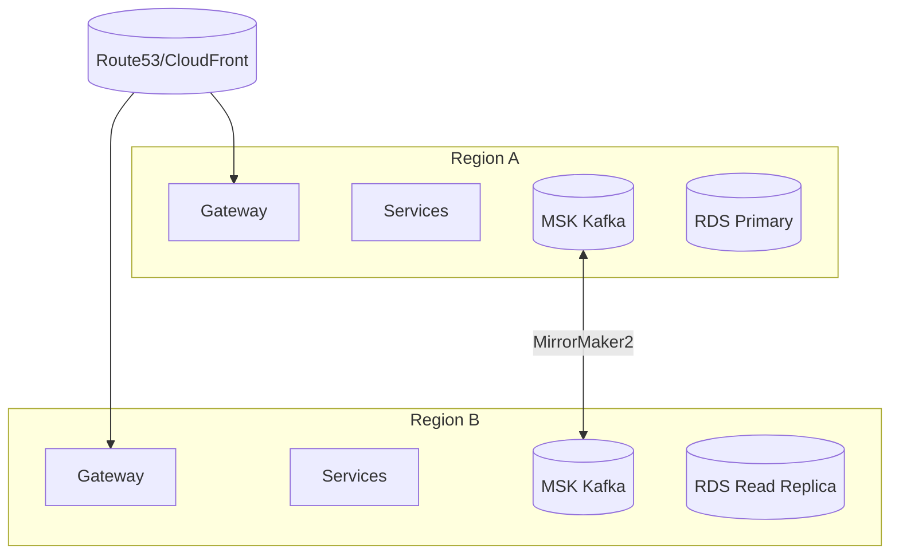

# Week 9 — Multi-Region Architecture and Global Routing

## What
- Deploy services across two AWS regions (e.g., us-east-1, us-west-2).
- Use Kafka MirrorMaker 2 for cross-region topic replication.
- Add global routing with Route53/CloudFront and region-aware traffic policies.
- Define data strategy: read-local, write-primary; failover/partition handling.

## Why
- Reduce latency for geo-distributed users.
- Survive regional outages with active-active or active-passive posture.
- Keep event streams synchronized across regions.

## How (behind the scenes)
- MSK clusters in both regions; MirrorMaker 2 replicates critical topics with per-topic configs.
- Service discovery and Gateway DNS via Route53 latency-based routing; health checks remove unhealthy region.
- Data: primary writes in Region A; Region B serves reads + async writes with conflict-avoidance keys or per-region shard keys.
- Idempotent producers and consumer offset management per region to avoid duplication.

## Architecture (Mermaid)

## Learner outcomes
- Configure multi-region routing and health checks.
- Plan replication and consistency models for streams and databases.
- Design failover/runbook procedures and test them.

## Scenario Q&A
- Q: How to avoid duplicate processing on regional failover?
  - What: at-least-once + consumer rebalance can replay.
  - How: idempotency keys and side-effect logs; partition assignments verified; use distinct consumer groups per region where needed.
- Q: What happens if MirrorMaker lags?
  - Why: network congestion or spikes.
  - How: monitor lag; backpressure producers; prioritize critical topics; scale MirrorMaker workers.
- Q: Reads stale in secondary region?
  - What: replication lag from primary.
  - How: read-your-writes with session tokens for critical paths; route to primary when consistency required.
