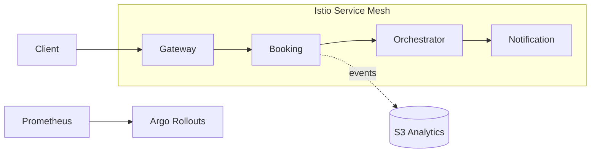

# Week 10 — Enterprise Security, Service Mesh, Progressive Delivery, and Analytics

## What
- Secure Gateway with JWT/OAuth2 and route-level scopes; add Redis rate limiting.
- Install Istio and enable STRICT mTLS; configure retries, timeouts, and outlier detection.
- Progressive delivery with Argo Rollouts canary + Prometheus analysis.
- Cost and autoscaling tuning (requests/limits, HPA/KEDA signals).
- Feature flags and analytics hooks (event export to S3).

## Why
- Defense-in-depth across edge and mesh; least-privilege access.
- Safer releases via canaries with automated metrics-based promotion/rollback.
- Right-size resources to control cost while maintaining SLOs.
- Feature-flagged analytics enables product insights without risky deploys.

## How (behind the scenes)
- Gateway: OAuth2 resource server validates JWT via JWKS; per-route `hasAuthority` scopes; Redis-based rate limit key on remote address.
- Istio: PeerAuthentication STRICT mTLS; DestinationRule `ISTIO_MUTUAL`, timeouts/retries/outlier detection; VirtualService routes.
- Argo Rollouts: canary steps (setWeight/pause); AnalysisTemplate queries Prometheus success rate; automatic rollback on failed checks.
- Autoscaling: HPA targets CPU/memory; can extend with KEDA for Kafka lag; tune requests/limits for stable p95 latency.
- Analytics: S3Exporter toggled via env; Trip events mirrored to S3 for offline analytics; IRSA/Secrets for credentials.

## Architecture (Mermaid)

## Learner outcomes
- Enforce JWT scopes and implement per-route rate limits.
- Configure Istio mTLS and traffic policies.
- Perform canary deployments with metric analysis and rollback.
- Tune resources and autoscaling to balance cost and performance.
- Implement feature-flagged analytics with secure cloud access.

## Scenario Q&A
- Q: Canary shows rising 5xx — roll forward or back?
  - Why: new version regression.
  - How: Rollouts pauses and rolls back automatically when analysis fails; inspect dashboard and traces, fix, redeploy.
- Q: Valid token but 403 at a route?
  - What: missing scope.
  - How: add proper claim/scope to token or adjust route authorization expression.
- Q: mTLS breaks cross-namespace calls?
  - Why: policy/DR mismatch.
  - How: ensure PeerAuthentication and DestinationRule align, and services have sidecars injected.
- Q: High cost spikes with low CPU?
  - What: requests too high or memory-bound.
  - How: right-size requests/limits; review p95/p99 latency and GC; consider KEDA on event-driven workloads.
