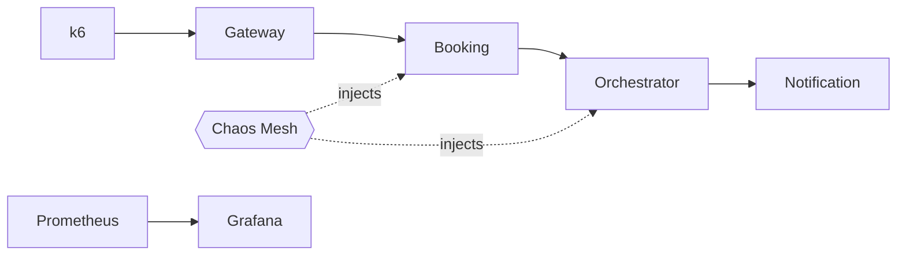

# Week 11 — Chaos Engineering, Fault Injection, and Load Testing

## What
- Introduce chaos experiments (Chaos Mesh/Litmus) for pod kill and network delay.
- Define steady-state hypotheses and abort conditions.
- Run k6 load tests with thresholds; integrate into CI.
- Capture findings in runbooks and dashboards.

## Why
- Validate resilience, timeouts, retries, and graceful degradation before incidents.
- Quantify error budgets and ensure SLOs under stress and failures.
- Institutionalize repeatable experiments for ongoing reliability.

## How (behind the scenes)
- Chaos Mesh `PodChaos` kills driver-service pods; `NetworkChaos` adds 2s latency from booking→orchestrator.
- Istio policies (retries/timeouts/outlier detection) mitigate failures; Prometheus alerts catch spikes/lag.
- k6 simulates booking flow with latency and success rate thresholds; GitHub Actions runs nightly.
- Runbook links experiments, dashboards, and rollback/disable steps.

## Architecture (Mermaid)

## Learner outcomes
- Design and run chaos experiments with clear hypotheses and SLO checks.
- Tune timeouts/retries/circuit breaking in the mesh.
- Automate load tests and interpret dashboards/alerts.

## Scenario Q&A
- Q: Error rate spikes during pod kill — expected?
  - What: brief 5xx until retries take effect.
  - How: ensure maxRetries/backoff and outlier detection; check p95/p99 and alert thresholds.
- Q: Latency budget blown under network delay?
  - Why: upstream timeout < downstream total time or retry storm.
  - How: align timeouts with budgets; add jitter/backoff; consider fallback or queueing.
- Q: Nightly k6 fails intermittently?
  - What: environment or data drift.
  - How: seed test data, tighten thresholds per SLO, add retries for setup steps.
