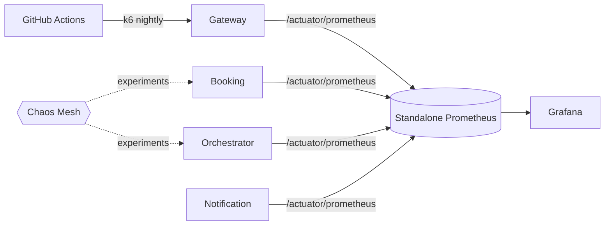

# Week 12 — Standalone Prometheus, Custom Alerts, Nightly Load Tests, and Advanced Chaos

## What
- Deploy a standalone Prometheus with custom scrape configs and alert rules.
- Wire Grafana dashboards and alerting for golden signals and resilience checks.
- Add GitHub Actions workflow for nightly k6 load testing with thresholds.
- Expand chaos experiments (longer network delay, pod kill loops, topic lag).

## Why
- Own observability lifecycle independent of cluster add-ons.
- Proactive detection with tailored SLO-driven alerts.
- Continuous performance validation catches regressions early.
- Stress the system in production-like patterns to validate runbooks.

## How (behind the scenes)
- Prometheus manifests: namespace, ConfigMap (scrapes for gateway, booking, orchestrator, notification), rules ConfigMap (latency, error rate, HPA/KEDA saturation, Kafka lag), Deployment mounting both.
- Grafana provisioning loads service dashboards and gateway canary dashboard.
- GitHub Actions `k6-nightly.yml` runs booking flow test; secrets for base URL and token; artifacts posted.
- Chaos Mesh manifests: `pod-kill-driver.yaml`, `net-delay-booking-orchestrator.yaml` (2s); extend with schedules and longer durations.

## Architecture (Mermaid)

## Learner outcomes
- Operate Prometheus via manifests and manage custom alert rules.
- Create effective SLO-aligned alerts and dashboards.
- Automate nightly load tests and read results.
- Design advanced chaos to validate alerts, SLOs, and runbooks.

## Scenario Q&A
- Q: Too many noisy alerts at night?
  - What: thresholds not aligned with SLO or traffic patterns.
  - How: use burn-rate alerts (multi-window, multi-burn) and time-aware silences/windows.
- Q: k6 nightly shows increased p95 latency after a rollout?
  - Why: resource regression or retry behavior.
  - How: compare dashboards pre/post, check Rollouts analysis, tune requests/limits and timeouts.
- Q: Kafka consumer lag alert fires during chaos?
  - What: intentional delay or insufficient consumer concurrency.
  - How: increase partitions/replicas, enable KEDA on lag, verify idempotency.
